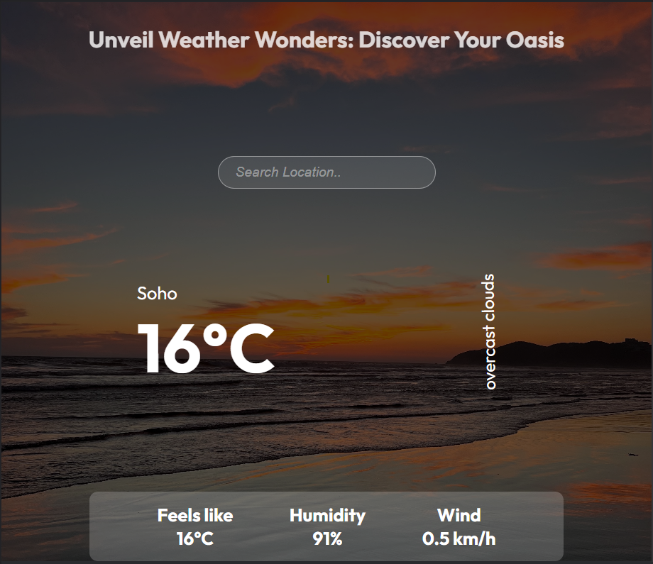

  

https://weather-sphere.netlify.app

# WeatherWise App

 

WeatherWise is your go-to weather application for quick and accurate weather information. With a simple and intuitive interface, the app allows you to enter any location and instantly access real-time weather details. From the current temperature to the 7-day forecast, WeatherWise keeps you informed so you can plan your day with confidence.

## Features

- Real-time weather updates for any location
- Detailed information on temperature, humidity, and wind speed
- Responsive design for seamless use on all devices

Enjoy the power of WeatherWise and become a weather ninja. Stay ahead of the forecast with this cool and tiny app!

## Live Site

You can see the live site at [weather-sphere.netlify.app](https://weather-sphere.netlify.app).

# Installation and Usage

### Prerequisites

Before you start, make sure you have Node.js and npm (Node Package Manager) installed on your machine.

### Installation

1. Clone the repository:
git clone https://github.com/PresidentIsmail/Weather-Sphere.git

2. Navigate to the project directory:
cd weatherwise

3. Install dependencies:
npm install

### Usage

1. Sign up for a free API key from the [OpenWeatherAPI](https://openweathermap.org/api) website.
2. Create a `.env` file in the root directory of your project and add your API key:
3. REACT_APP_API_KEY=your_openweatherapi_key
4. Ensure the variable name is `REACT_APP_API_KEY` to access the key correctly.
5. Start the app:

The app will be running at http://localhost:3000.

### Note

Please ensure your API key is kept secure and not shared publicly.

## License

This project is licensed under the [MIT License](LICENSE).

